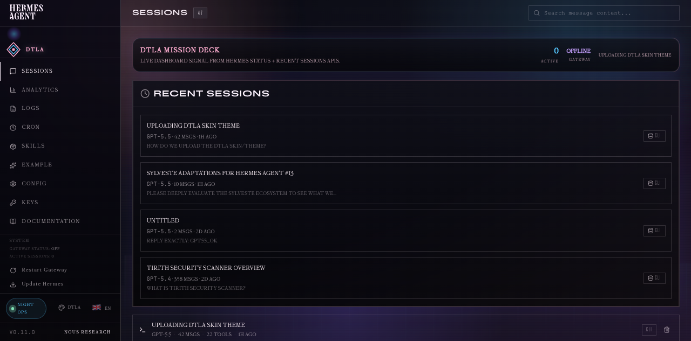

# DTLA Hermes Dashboard

DTLA is a minimal noir operations skin for Hermes Agent: black glass, millennial pink, electric blue, and violet glow. It includes both hackathon tracks:

- Theme: `theme/dtla.yaml`
- Plugin: `plugins/dtla-mission-control/`

The theme keeps the dashboard in the standard layout to avoid sidebar collisions with other installed plugins. The companion plugin adds a persistent Now Bar above every page: gateway health, active runs, latest trace, and the next useful action in one restrained strip. It also adds a small header crest and night-ops status pill.

## Install

```bash
git clone https://github.com/mistakeknot/dtla-hermes-dashboard.git
cd dtla-hermes-dashboard
./scripts/install.sh
hermes dashboard
```

Then open the dashboard, click the palette icon, and select `DTLA`.

If the dashboard is already running, force plugin discovery without restart:

```bash
curl --max-time 3 -fsS http://127.0.0.1:9119/api/dashboard/plugins/rescan
```

## Manual install

```bash
mkdir -p ~/.hermes/dashboard-themes ~/.hermes/plugins
cp theme/dtla.yaml ~/.hermes/dashboard-themes/dtla.yaml
cp -R plugins/dtla-mission-control ~/.hermes/plugins/dtla-mission-control
```

Refresh `hermes dashboard`, select `DTLA`, and the Now Bar appears above each page.

## What it demonstrates

- A full dashboard theme using palette, typography, standard layout, assets, component chrome, color overrides, and custom CSS.
- A no-build dashboard plugin using `window.__HERMES_PLUGIN_SDK__`.
- Slot injection into `pre-main`, `header-left`, and `header-right`.
- A persistent Now Bar that keeps gateway health, active runs, latest trace, and the next useful action visible across routes.
- Live data from `SDK.api.getStatus()` and `SDK.api.getSessions()`.
- Theme/plugin composition without forking Hermes or running an npm build.
## Files

```text
theme/dtla.yaml
plugins/dtla-mission-control/dashboard/manifest.json
plugins/dtla-mission-control/dashboard/dist/index.js
plugins/dtla-mission-control/dashboard/dist/style.css
scripts/install.sh
```

## Screenshots




## License

MIT
